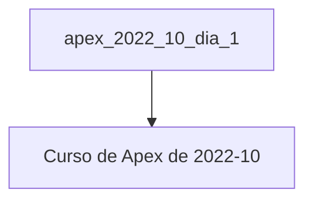

---
{"dg-publish":true,"permalink":"/aprendendo-a-usar-o-digital-garden/","dgHomeLink":true,"dgPassFrontmatter":false}
---


A ideia é que essa nota sirva como uma vitrine das coisas que são possíveis de serem feitas usando o Digital Garden.

# Título 1, maior de todos

Esse é o primeiro título, o maior de todos. Além disso, **algumas coisas** estão em negrito enquanto *outras* estão em itálico ou ==marcados==.
Essa linha não teve duas quebras, apenas uma.

## Título 2, levemente menor

Aqui é o segundo título

Com duas quebras.

### Título 3

Terceiro.
- Com uma lista
	- com identação
- Sem identação

Com quebra de linha.

- Um item

- Outro item

#### Títilo 4, dificilmente vou mais longe que isso

É bem raro eu ir além de 4 títulos, a maioria do tempo eu uso o 2º título.

## Callouts

Aqui seguem os callouts que devo usar.

>[!info] info
>Uma ideia legal é colocar as coisas de forma mais organizada.

>[!question] question
>Aqui ficariam as perguntas. Engraçado que ficou verde!

>[!done] done
>Aqui seriam as minhas tarefas feitas ou coisas que deram certo.

>[!warning] warning
>Esse seria o alerta, mas ficou feio

>[!failure]- failure
>Testando o fold. Deu ruim.

É isso. Mais que 5 me deixaria louco. Vou colocar nessa ordem no fastkeys. Adorei isso aqui.

## Códigos

Aqui vou colocar alguns códigos, coisa que vou quere usar bastante.

```sql
select
	id_aerodromo,
	nm_aerodromo
from
	crp_aerodromo.aerodromo
where
	id_aerodromo = :p3_id_aerodromo
order by 1;
```

```plsql
declare
	v_count number;
begin
	select count(*) into v_count
	from
		crp_aerodromo.aerodromo
	where
		id_aerodromo = :p3_id_aerodromo;

	dbms_output.put_line(v_count);
end;
```

```html
<p> Um <b>importante</b> parágrafo.</p>
```

## Mermaid

Aqui algo que não devo usar tanto, mas toda vez que for usar, será **bem** legal.



## Foto

Depois eu coloco uma foto aqui, pois vou precisar para colocar as modelagens.