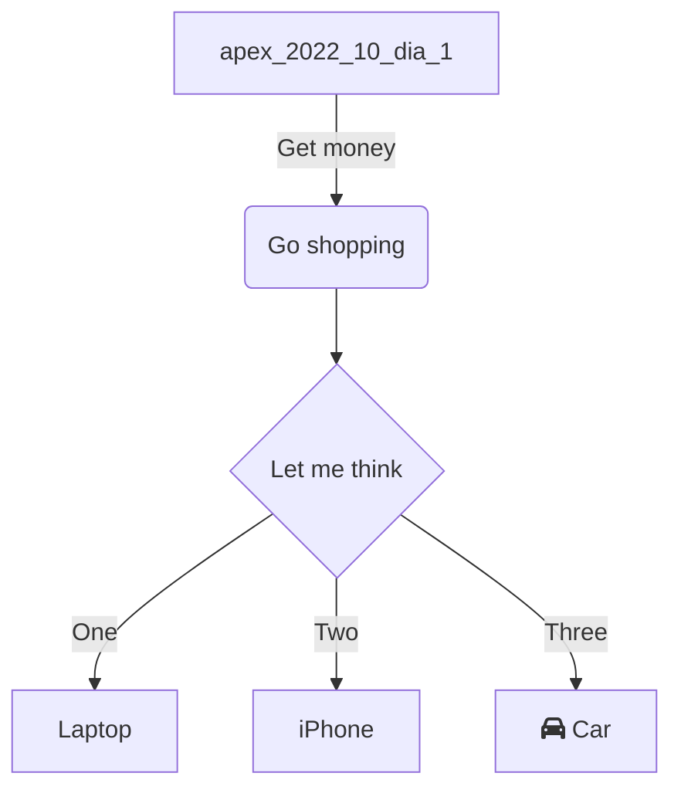

---
{"dg-publish":true,"permalink":"/curso-de-apex-de-2022-10/","tags":"gardenEntry","dgHomeLink":true,"dgPassFrontmatter":false}
---

# Curso de Apex de Outubro de 2022
Boa noite!
A ideia dessa nota é testar várias pequenas coisas.
A primeira é como vai se comportar os blocos de código.
```sql
select *
from financas.transacoes;
-- Algum comentário
select
    id_transacao,
    nm_transacao
into
    v_id_transacao,
    v_nm_transacao
from financas.transacoes
where id_transacao = :p2_id_transacao;
```

A segunda é como se comporta o mermaid

A terceira é como se comporta com as notas juntas. Vou criar a nota [[apex_2022_10_dia_1|apex_2022_10_dia_1]]
Por fim, quero ter notas que não estão linkadas para ver o que acontece. Essa será a nota do segundo dia.