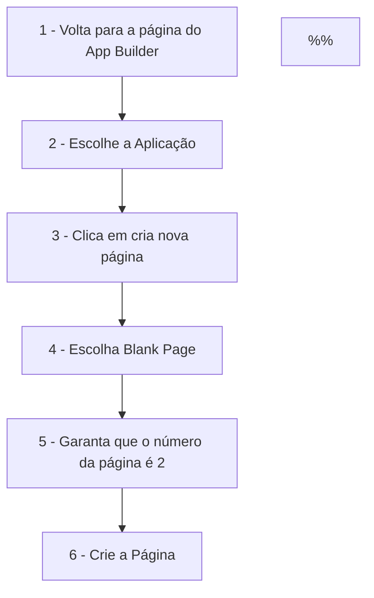

---
{"dg-publish":true,"permalink":"/atividades/apex-2022-10-atividade-02-adicionar-pagina/","dgHomeLink":true,"dgPassFrontmatter":false}
---

up:: [[Curso de Apex de 2022-10|Curso de Apex de 2022-10]]

# Atividade 02 - Adicionar uma Página

